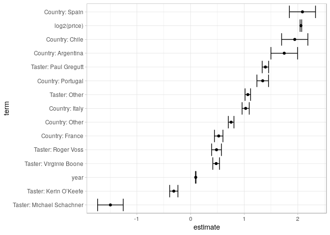

Wine\_screencast
================

``` r
library(tidyverse)
```

    ## ── Attaching packages ────────────────────────────────────────────────────────────────────────── tidyverse 1.2.1.9000 ──

    ## ✔ ggplot2 3.1.1.9000     ✔ purrr   0.3.2     
    ## ✔ tibble  2.1.1          ✔ dplyr   0.8.0.1   
    ## ✔ tidyr   0.8.3          ✔ stringr 1.4.0     
    ## ✔ readr   1.3.1          ✔ forcats 0.4.0

    ## ── Conflicts ────────────────────────────────────────────────────────────────────────────────── tidyverse_conflicts() ──
    ## ✖ dplyr::filter() masks stats::filter()
    ## ✖ dplyr::lag()    masks stats::lag()

``` r
library(broom)
theme_set(theme_light())
wine_ratings <- readr::read_csv("https://raw.githubusercontent.com/rfordatascience/tidytuesday/master/data/2019/2019-05-28/winemag-data-130k-v2.csv") %>% 
  select(-X1) %>% # clean a bit
  extract(title, "year", "(20\\d\\d)", convert = T, remove = F) %>% 
  mutate(year = ifelse(year>=1900, year, NA))
```

    ## Warning: Missing column names filled in: 'X1' [1]

    ## Parsed with column specification:
    ## cols(
    ##   X1 = col_double(),
    ##   country = col_character(),
    ##   description = col_character(),
    ##   designation = col_character(),
    ##   points = col_double(),
    ##   price = col_double(),
    ##   province = col_character(),
    ##   region_1 = col_character(),
    ##   region_2 = col_character(),
    ##   taster_name = col_character(),
    ##   taster_twitter_handle = col_character(),
    ##   title = col_character(),
    ##   variety = col_character(),
    ##   winery = col_character()
    ## )

``` r
# library(RVerbalExpressions) 
# pattern <- rx_begin_capture() %>%  rx_digit() %>% rx_multiple(4) %>% rx_end_capture()
```

``` r
wine_ratings %>% glimpse() # could predict the pionts 80-100 from other information
```

    ## Observations: 129,971
    ## Variables: 14
    ## $ country               <chr> "Italy", "Portugal", "US", "US", "US", "Sp…
    ## $ description           <chr> "Aromas include tropical fruit, broom, bri…
    ## $ designation           <chr> "Vulkà Bianco", "Avidagos", NA, "Reserve L…
    ## $ points                <dbl> 87, 87, 87, 87, 87, 87, 87, 87, 87, 87, 87…
    ## $ price                 <dbl> NA, 15, 14, 13, 65, 15, 16, 24, 12, 27, 19…
    ## $ province              <chr> "Sicily & Sardinia", "Douro", "Oregon", "M…
    ## $ region_1              <chr> "Etna", NA, "Willamette Valley", "Lake Mic…
    ## $ region_2              <chr> NA, NA, "Willamette Valley", NA, "Willamet…
    ## $ taster_name           <chr> "Kerin O’Keefe", "Roger Voss", "Paul Gregu…
    ## $ taster_twitter_handle <chr> "@kerinokeefe", "@vossroger", "@paulgwine …
    ## $ title                 <chr> "Nicosia 2013 Vulkà Bianco  (Etna)", "Quin…
    ## $ year                  <int> 2013, 2011, 2013, 2013, 2012, 2011, 2013, …
    ## $ variety               <chr> "White Blend", "Portuguese Red", "Pinot Gr…
    ## $ winery                <chr> "Nicosia", "Quinta dos Avidagos", "Rainsto…

``` r
wine_ratings %>% 
  count(country, sort = T) # typical wine countries
```

    ## # A tibble: 44 x 2
    ##    country       n
    ##    <chr>     <int>
    ##  1 US        54504
    ##  2 France    22093
    ##  3 Italy     19540
    ##  4 Spain      6645
    ##  5 Portugal   5691
    ##  6 Chile      4472
    ##  7 Argentina  3800
    ##  8 Austria    3345
    ##  9 Australia  2329
    ## 10 Germany    2165
    ## # … with 34 more rows

``` r
wine_ratings %>% 
  count(designation, sort = T) # anytime a categorical data, count it!
```

    ## # A tibble: 37,980 x 2
    ##    designation       n
    ##    <chr>         <int>
    ##  1 <NA>          37465
    ##  2 Reserve        2009
    ##  3 Estate         1322
    ##  4 Reserva        1259
    ##  5 Riserva         698
    ##  6 Estate Grown    621
    ##  7 Brut            513
    ##  8 Dry             413
    ##  9 Barrel sample   375
    ## 10 Crianza         343
    ## # … with 37,970 more rows

``` r
wine_ratings %>% 
  count(country, region_1, sort = T) # not meaningful to count region without country
```

    ## # A tibble: 1,273 x 3
    ##    country   region_1                 n
    ##    <chr>     <chr>                <int>
    ##  1 Portugal  <NA>                  5691
    ##  2 US        Napa Valley           4480
    ##  3 Chile     <NA>                  4472
    ##  4 US        Columbia Valley (WA)  4124
    ##  5 Austria   <NA>                  3345
    ##  6 US        Russian River Valley  3091
    ##  7 US        California            2629
    ##  8 US        Paso Robles           2350
    ##  9 Argentina Mendoza               2301
    ## 10 US        Willamette Valley     2301
    ## # … with 1,263 more rows

``` r
wine_ratings %>% 
  count(taster_name,  sort = T) 
```

    ## # A tibble: 20 x 2
    ##    taster_name            n
    ##    <chr>              <int>
    ##  1 <NA>               26244
    ##  2 Roger Voss         25514
    ##  3 Michael Schachner  15134
    ##  4 Kerin O’Keefe      10776
    ##  5 Virginie Boone      9537
    ##  6 Paul Gregutt        9532
    ##  7 Matt Kettmann       6332
    ##  8 Joe Czerwinski      5147
    ##  9 Sean P. Sullivan    4966
    ## 10 Anna Lee C. Iijima  4415
    ## 11 Jim Gordon          4177
    ## 12 Anne Krebiehl MW    3685
    ## 13 Lauren Buzzeo       1835
    ## 14 Susan Kostrzewa     1085
    ## 15 Mike DeSimone        514
    ## 16 Jeff Jenssen         491
    ## 17 Alexander Peartree   415
    ## 18 Carrie Dykes         139
    ## 19 Fiona Adams           27
    ## 20 Christina Pickard      6

``` r
wine_ratings %>% 
  count(variety,  sort = T) 
```

    ## # A tibble: 708 x 2
    ##    variety                      n
    ##    <chr>                    <int>
    ##  1 Pinot Noir               13272
    ##  2 Chardonnay               11753
    ##  3 Cabernet Sauvignon        9472
    ##  4 Red Blend                 8946
    ##  5 Bordeaux-style Red Blend  6915
    ##  6 Riesling                  5189
    ##  7 Sauvignon Blanc           4967
    ##  8 Syrah                     4142
    ##  9 Rosé                      3564
    ## 10 Merlot                    3102
    ## # … with 698 more rows

``` r
wine_ratings %>% 
  filter(!is.na(designation)) %>% 
  count(variety,  designation, sort = T) 
```

    ## # A tibble: 47,432 x 3
    ##    variety                  designation       n
    ##    <chr>                    <chr>         <int>
    ##  1 Cabernet Sauvignon       Reserve         475
    ##  2 Chardonnay               Reserve         327
    ##  3 Bordeaux-style Red Blend Barrel sample   300
    ##  4 Pinot Noir               Reserve         282
    ##  5 Sangiovese               Riserva         266
    ##  6 Sparkling Blend          Brut            235
    ##  7 Riesling                 Dry             231
    ##  8 Bordeaux-style Red Blend Barrel Sample   223
    ##  9 Pinot Noir               Estate          208
    ## 10 Tempranillo              Crianza         194
    ## # … with 47,422 more rows

``` r
wine_ratings %>% 
  count(winery,  sort = T) 
```

    ## # A tibble: 16,757 x 2
    ##    winery                    n
    ##    <chr>                 <int>
    ##  1 Wines & Winemakers      222
    ##  2 Testarossa              218
    ##  3 DFJ Vinhos              215
    ##  4 Williams Selyem         211
    ##  5 Louis Latour            199
    ##  6 Georges Duboeuf         196
    ##  7 Chateau Ste. Michelle   194
    ##  8 Concha y Toro           164
    ##  9 Columbia Crest          159
    ## 10 Kendall-Jackson         130
    ## # … with 16,747 more rows

``` r
wine_ratings %>%
  ggplot(aes(year))+
  geom_histogram()
```

    ## `stat_bin()` using `bins = 30`. Pick better value with `binwidth`.

    ## Warning: Removed 6345 rows containing non-finite values (stat_bin).

<!-- -->

``` r
wine_ratings %>%
  ggplot(aes(points))+
  geom_histogram(binwidth = 1)
```

<!-- -->

``` r
wine_ratings %>% 
  ggplot(aes(price))+
  geom_histogram()+
  scale_x_log10()
```

    ## `stat_bin()` using `bins = 30`. Pick better value with `binwidth`.

    ## Warning: Removed 8996 rows containing non-finite values (stat_bin).

<!-- -->

``` r
ggplot(wine_ratings, aes(price, points))+
  geom_point(alpha=.1)+
  scale_x_log10()+
  geom_smooth(method = "lm") # this chart confirms relationship and price should be a predictor
```

    ## Warning: Removed 8996 rows containing non-finite values (stat_smooth).

    ## Warning: Removed 8996 rows containing missing values (geom_point).

<!-- -->

``` r
lm(points~log2(price), wine_ratings) %>% summary()
```

    ## 
    ## Call:
    ## lm(formula = points ~ log2(price), data = wine_ratings)
    ## 
    ## Residuals:
    ##      Min       1Q   Median       3Q      Max 
    ## -14.0559  -1.5136   0.1294   1.7133   9.2408 
    ## 
    ## Coefficients:
    ##              Estimate Std. Error t value Pr(>|t|)    
    ## (Intercept) 78.981419   0.035765    2208   <2e-16 ***
    ## log2(price)  1.974162   0.007338     269   <2e-16 ***
    ## ---
    ## Signif. codes:  0 '***' 0.001 '**' 0.01 '*' 0.05 '.' 0.1 ' ' 1
    ## 
    ## Residual standard error: 2.408 on 120973 degrees of freedom
    ##   (8996 observations deleted due to missingness)
    ## Multiple R-squared:  0.3744, Adjusted R-squared:  0.3744 
    ## F-statistic: 7.239e+04 on 1 and 120973 DF,  p-value: < 2.2e-16

Every time the price doubles, points expected to increase by 2

``` r
model <- wine_ratings %>% 
  replace_na(list(taster_name = "Missing",
                  country = "Missing"
                  )) %>% 
  mutate(taster_name = fct_lump(taster_name, 6) %>% fct_relevel("Missing")) %>%   
  mutate(country = fct_lump(country, 7) %>% fct_relevel("US")) %>% 
  lm(points~log2(price) + country + year + taster_name, data =.) 

model %>% 
  tidy(conf.int = T) %>% 
  filter(term != "(Intercept)") %>% 
  mutate(term = term %>%
           str_replace("country", "Country: ") %>%
           str_replace("taster_name", "Taster: ") %>% 
           fct_reorder(estimate)
         ) %>%
  ggplot(aes(estimate, term)) +
  geom_point()+
  geom_errorbarh(aes(xmin = conf.low, xmax = conf.high))
```

<!-- -->

all coefs have significance, not to worry

However, the model only explained 0.4 of the variance in points.

``` r
model %>% 
  augment(data = wine_ratings) %>% 
  ggplot(aes(.fitted, points))+
  geom_point(alpha = .1)
```

<!-- -->

``` r
anova(model) %>% 
  tidy() %>% 
  mutate(portion = sumsq / sum(sumsq))
```

    ## # A tibble: 5 x 7
    ##   term            df   sumsq    meansq statistic p.value portion
    ##   <chr>        <int>   <dbl>     <dbl>     <dbl>   <dbl>   <dbl>
    ## 1 log2(price)      1 394109. 394109.      74174.       0  0.371 
    ## 2 country          7  19545.   2792.        525.       0  0.0184
    ## 3 year             1  17814.  17814.       3353.       0  0.0168
    ## 4 taster_name      6  17995.   2999.        564.       0  0.0170
    ## 5 Residuals   115139 611767.      5.31       NA       NA  0.576

### Lasso regression on words in description

``` r
library(tidytext)
```

``` r
wine_rating_words <- wine_ratings %>% 
  mutate(wine_id = row_number()) %>% 
  unnest_tokens(word, description) %>% 
  anti_join(stop_words, by = "word") 

wine_rating_words <- wine_rating_words %>% 
  filter(!word %in% c("wine", "drink"))
```

``` r
wine_rating_words %>% 
  count(word, sort = T)
```

    ## # A tibble: 32,799 x 2
    ##    word        n
    ##    <chr>   <int>
    ##  1 flavors 62791
    ##  2 fruit   49927
    ##  3 aromas  39639
    ##  4 palate  38437
    ##  5 acidity 34999
    ##  6 finish  34971
    ##  7 tannins 30877
    ##  8 cherry  29321
    ##  9 black   29020
    ## 10 ripe    27375
    ## # … with 32,789 more rows
